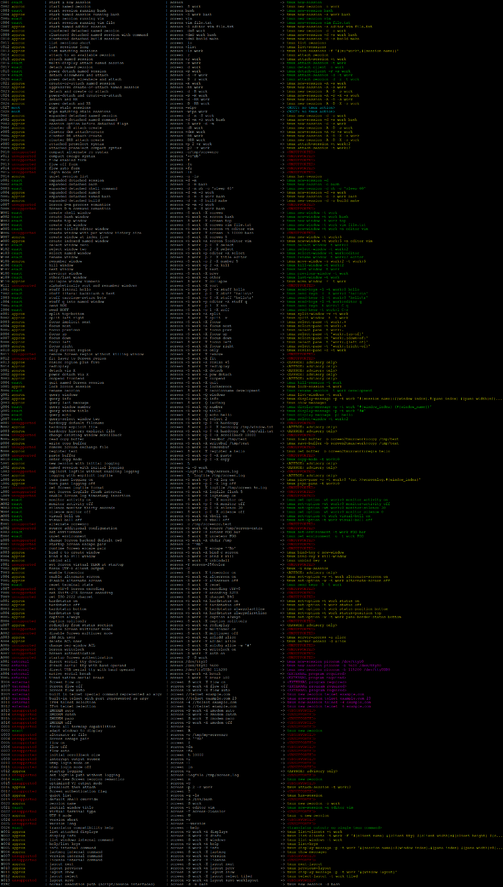

# screen-to-tmux-translator 0.4.28

A POSIX-shell compatibility translator that gives tmux a GNU Screen-compatible command-line identity.

The literal one-physical-line function is here:
[`bin/screen-function-source-minified.oneliner.sh`](https://github.com/screen-to-tmux-translator/screen-to-tmux-translator/blob/main/bin/screen-function-source-minified.oneliner.sh "screen-function-source-minified.oneliner.sh").
The README intentionally does **not** inline that ~80 KiB line: GitHub or browser rendering can visually wrap an enormous code line and make a real one-liner look multiline. The linked file itself remains exactly one physical line.

## Download, build and test

To download the project, build the default patched tmux 3.7c release, and run the complete test suite:

```sh
wget -q https://github.com/screen-to-tmux-translator/screen-to-tmux-translator/archive/refs/heads/main.zip -O stt.zip && rm -rf screen-to-tmux-translator-main && unzip -q stt.zip && cd screen-to-tmux-translator-main && sh run-tests.sh --build
```

## What you have after that command

The command above builds a patched tmux and installs two hardlinked names in the project build tree:

```text
./build/tmux-3.7c-patched/install/bin/tmux
./build/tmux-3.7c-patched/install/bin/screen
```

`screen` is a real filesystem hardlink to the patched `tmux` executable. When that binary starts with `argv[0]` named `screen`, the native compatibility layer translates Screen-style argv before tmux parses its normal command line. Invoking the same inode as `tmux` bypasses the Screen translator and behaves as ordinary tmux.

The package also provides the same translator as a POSIX shell function. To load it into the current shell instead of using the compiled hardlink:

```sh
. ./bin/screen-function-source.sh
```

After that, use `screen` normally. The shell function shadows an installed Screen executable in that shell; `command screen ...` still bypasses the function and asks the shell to find an external executable.

For a one-shot standalone shell command without modifying the current shell:

```sh
sh ./bin/screen.sh [Screen arguments ...]
```

## Common Screen commands

The translator is intended to let existing Screen-oriented command lines keep their familiar shape while tmux performs the actual work. Common examples:

| Screen command | tmux action | Class |
| --- | --- | --- |
| `screen` | `tmux new-session` | EXACT |
| `screen -S work` | `tmux new-session -s work` | APPROX because Screen permits duplicate `PID.name` labels while tmux session names are unique |
| `screen -dmS work` | `tmux new-session -d -s work` | APPROX |
| `screen -ls` | `tmux list-sessions` | APPROX because the output/session model differs |
| `screen -r` | `tmux attach-session` | APPROX because automatic session selection differs |
| `screen -r work` | `tmux attach-session -t work` | APPROX because Screen normally resumes a detached session while tmux permits another client |
| `screen -x work` | `tmux attach-session -t work` | EXACT for the multi-client intent |
| `screen -d work` | `tmux detach-client -s work` | EXACT |
| `screen -d -r work` | `tmux attach-session -d -t work` | EXACT |
| `screen -R work` | `tmux new-session -A -s work` | APPROX because Screen and tmux choose/reuse sessions differently |
| `screen -S work -X screen` | `tmux new-window -t work` | EXACT |
| `screen -S work -p 2 -X select` | `tmux select-window -t work:2` | EXACT |
| `screen -S work -p 0 -X stuff hello` | `tmux send-keys -l -t work:0 hello` | EXACT |
| `screen -S work -X quit` | `tmux kill-session -t work` | EXACT |
| `screen -S work -Q windows` | `tmux list-windows -t work` | APPROX because output formatting differs |

`--dry-run` is a translator extension that prints the tmux argv instead of executing it:

```sh
screen --dry-run -S work -X stuff hello
```

`--strict` keeps only exact mappings executable. APPROX and EXTERNAL mappings become advisory, and parser-invalid Screen syntax is rejected rather than silently ignored:

```sh
screen --strict -r work
```

The complete command matrix is much larger than the common examples above. The build/test output uses green for exact mappings, yellow for approximations, red for unsupported/invalid cases, cyan for moot operations, and magenta for external-helper mappings.

[](docs/command-conversion-chart.png)

The image above is the colored conversion chart produced from the tested mapping set; click it for the full-size view. The machine-readable source inventory is `docs/screen-5.0.2-command-manifest.tsv`, and the executable test matrix lives in `tests/cases.sh`.

## Files in `bin/`

`bin/screen.sh` is the readable standalone POSIX-shell implementation. Its first function is `screen ()`; the private `_s2t_*` helpers follow; the last line invokes `screen "$@"`. It can be copied and run by itself with `sh`.

`bin/screen-function-source.sh` is the readable sourceable form of `screen.sh`. It has the same 55-function implementation and helper order, but deliberately does **not** invoke `screen "$@"` at EOF. Source it with the POSIX dot command so `screen()` remains in the current shell.

`bin/screen-function-source-minified.sh` is the mechanically minified sourceable form. It is derived from `screen-function-source.sh` by removing full-line comments and blank lines; it keeps the same functions and behavior.

`bin/screen-function-source.oneliner.sh` is a literal one-physical-line source form retained for compact/compatibility use.

`bin/screen-function-source-minified.oneliner.sh` is the smallest literal one-physical-line source form and is the preferred artifact when an actual pasteable one-line function is wanted. It is linked at the top of this README instead of being embedded here, so front-page rendering cannot make the one-line file look multiline.

All five shell interfaces are checked against the same canonical cases. When a patched tmux build is present, its native `screen` hardlink joins the same equivalence matrix as a sixth interface.

## Build and test scripts

`run-tests.sh` is the main project entry point. With no build request it tests the packaged shell interfaces and any already-discovered builds:

```sh
sh run-tests.sh
```

`--build` builds the patched tmux variant first. With no version argument it uses the project-pinned tmux 3.7c release baseline:

```sh
sh run-tests.sh --build
sh run-tests.sh --build latest
sh run-tests.sh --build 3.7c,3.7d,latest
```

Add `--compile-original` when you also want a pristine original tmux build beside each patched build:

```sh
sh run-tests.sh --build 3.7c --compile-original
```

Useful display controls include:

```text
--verbosity quiet|normal|verbose
--quiet
--show-regression-test-pass
--show-invalid-test-series
--show-integration-checks
--show-behavior-test
```

Successful focused-regression rows, INVALID-series rows, compiled integration checks, and live behavior checks are quiet by default according to those controls; failures are still revealed automatically. Every detailed result remains in the timestamped logs and the final log ZIP.

The build-only entry points are:

```sh
sh build_tmux_patched.sh                 # patched 3.7c, default
sh build_tmux_patched.sh latest
sh build_tmux_patched.sh 3.7c,latest

sh build_tmux.sh 3.7c                    # original + patched
sh build_tmux.sh 3.7c,3.7d,latest
```

The version-specific wrappers (`build_tmux_3.7c*.sh`, `build_tmux_3.7d*.sh`, `build_tmux_latest*.sh`) remain convenience front ends. The shared implementation is `scripts/build-tmux-one.sh`.

Generated sources and builds are kept separate:

```text
src/tmux-VERSION/
src/tmux-VERSION-patched/
build/tmux-VERSION/
build/tmux-VERSION-patched/
```

Each successful build writes `BUILD-INFO`. Patched builds additionally install `screen` as a hardlink to the built `tmux`. Internal shell children are always invoked with `sh`, so GitHub ZIPs work even when executable permission bits are missing.

The normal build display is intentionally concise: Autoconf results are grouped, compiler commands are condensed to streaming `file.c ... [OK]` progress, and the complete raw transcript remains in the build log.

## How the POSIX shell implementation works

The readable sourceable implementation documents the same pipeline in `bin/screen-function-source.sh`:

```text
  screen "$@"
      |
      v
  strip translator-only switches (--dry-run/--dryrun/--strict)
      |
      v
  _s2t_parse_options  ---> parsed global translation state
      |
      +----------------+----------------+----------------+
      |                |                |
      v                v                v
   -Q query         -X command       top-level CLI
      |                |                |
      v                v                v
  _s2t_query       _s2t_xcommand    _s2t_top_*
      |                |                |
      +----------------+----------------+
                       |
                       v
                _s2t_tmux[_with_u]
                       |
                +------+------+
                |             |
                v             v
             dry-run       execution
```

The public `screen()` function is intentionally short and reads as orchestration rather than as one enormous parser. It initializes state, removes translator-owned flags, parses the Screen startup syntax, dispatches `-Q` and `-X`, and otherwise walks the top-level list/attach/policy/external/create phases.

The `-X` side is split into semantic families that parallel the native C implementation:

```text
_s2t_x_window   window creation, selection, naming and ordering
_s2t_x_pane     pane/region navigation and input
_s2t_x_session  session/client lifecycle
_s2t_x_buffer   copy buffers and hardcopy
_s2t_x_logging  logging and monitoring
_s2t_x_config   environment, key, terminal and configuration operations
_s2t_x_status   hardstatus and caption handling
_s2t_x_access   ACL and serial-control operations
_s2t_x_inspect  display/status inspection
_s2t_x_layout   saved-layout operations
```

Those family functions deliberately remain flat decision lists: for a compatibility translator, it is easier to audit one Screen command beside the tmux operation it selects than to hide mappings behind generic callbacks or a large data-driven framework.

The shell version uses normal POSIX positional parameters as its argv representation. It does not need the C implementation's argv builder and does not use shell-code reconstruction for the cleaned readable/minified implementations. Quoted `"$@"` boundaries are preserved when commands are handed to tmux.

### Mapping classes

| Class | Normal behavior | Strict behavior |
| --- | --- | --- |
| EXACT | execute the tmux mapping | execute |
| APPROX | explain the semantic difference, then execute when there is one concrete safe substitute; otherwise advisory | advisory only, status 3 |
| EXTERNAL | use a required helper such as `telnet` or `picocom` when a concrete mapping exists | advisory only, status 5 |
| UNSUPPORTED | report that no safe automatic mapping is implemented, status 2 | same |
| MOOT | explain why tmux makes the Screen operation unnecessary, status 4 | same |
| INVALID | permissive mode stops quietly without guessing | reject as invalid, status 64 |

This project intentionally does not emulate missing Screen subsystems on top of tmux. When the two programs have materially different object models, output formats, security scopes, configuration languages, or serial/network behavior, the translator labels that difference instead of pretending the mapping is exact.

## How the native tmux patch works

The native path implements the same policy directly inside tmux, without invoking `/bin/sh` or any of the shell helpers:

```text
    process argv
        |
        v
  screen_compat_translate()
        |  not "screen" ----------------------> return unchanged
        |
        v
  strip --dry-run / --dryrun / --strict
        |
        v
  screen_compat_parse_options() ---> struct screen_compat
        |
        +----------------+----------------+----------------+
        |                |                |
        v                v                v
     -Q query         -X command       top-level CLI
        |                |                |
        v                v                v
      query()        xcommand()        top_*()
        |                |                |
        +----------------+----------------+
                         |
                         v
                struct screen_compat_cmd
                         |
                +--------+---------+
                |                  |
                v                  v
             dry-run            execute
                |                  |
                v                  v
            print_cmd()       install_cmd()
```

`tmux.c` calls `screen_compat_translate(&argc, &argv)` once before tmux's ordinary command-line parser. The translator first checks whether the executable name is `screen`. If not, it returns immediately and tmux sees its original argv untouched.

If it is the `screen` hardlink, `screen-compat.c` parses Screen syntax into `struct screen_compat`, dispatches the same query/command/top-level families as the POSIX implementation, and builds a `struct screen_compat_cmd`. Dry-run prints that argv. Normal execution installs the translated argv back into tmux, after which the ordinary tmux parser proceeds normally.

The native implementation therefore keeps one executable and one process: there is no embedded shell source, no `/bin/sh`, and no fork/pipe/exec/wait translation bridge.

## For tmux developers: what the patch changes

The integration footprint is intentionally small and tmux-native:

```text
upstream file         change
-------------------   ---------------------------------------------------------
Makefile.am           add screen-compat.c to the tmux source list
tmux.h                declare screen_compat_translate(int *, char ***)
tmux.c                call screen_compat_translate() before normal CLI parsing
screen-compat.c       new compatibility translation unit
```

`tmux-integration/tmux-screen-compat.patch` contains only the three upstream edits. `tmux-integration/screen-compat.c` is copied into the source tree as the fourth changed path. The project builder applies the patch with `--fuzz=0` and verifies that the source footprint is **exactly** those three modified upstream files plus the new C file. If integration anchors move in a future tmux version, the build fails explicitly rather than applying a fuzzy guess.

The C file follows the surrounding tmux/BSD-C style: tab indentation, tmux-style braces and `return (value)`, static helpers, xmalloc-family allocation, tmux's `printflike`, `__dead` where appropriate, and an 80-column ceiling. Its large mapping families are split only when a real semantic boundary makes the code easier to navigate.

### Applying it manually to a clean tmux source tree

From the project root, with `TMUX_SRC` pointing at a clean tmux checkout:

```sh
TMUX_SRC=/path/to/tmux
PREFIX=/tmp/tmux-screen-install
BUILD=/tmp/tmux-screen-build

cp tmux-integration/screen-compat.c "$TMUX_SRC/screen-compat.c"
patch -d "$TMUX_SRC" -p1 --fuzz=0 --batch < tmux-integration/tmux-screen-compat.patch

(cd "$TMUX_SRC" && sh ./autogen.sh)
mkdir -p "$BUILD" "$PREFIX"
(cd "$BUILD" && "$TMUX_SRC/configure" --prefix="$PREFIX" && make -j4 && make install)
ln "$PREFIX/bin/tmux" "$PREFIX/bin/screen"
```

That is deliberately ordinary tmux Autotools integration. The `screen` name must be a hardlink (or another invocation whose `argv[0]` is `screen`) so the compatibility entry point can distinguish it from normal `tmux` execution.

### Easier and safer: let this project do it

For normal development, the project build system is preferable because it preserves the clean source, records provenance, checks dependencies, applies with zero fuzz, verifies the exact source footprint, builds out of tree, installs into an isolated prefix, creates the hardlink, and immediately makes the result discoverable by the equivalence/integration/behavior tests.

Build a supported upstream ref directly:

```sh
sh build_tmux_patched.sh 3.7c
sh build_tmux_patched.sh latest
```

Build both pristine and patched copies for comparison:

```sh
sh build_tmux.sh 3.7c
```

Test a local clean tmux working tree without modifying that tree in place:

```sh
TMUX_SOURCE_DIR=/path/to/clean/tmux sh build_tmux_patched.sh local
```

The builder copies that local tree under `src/tmux-local-patched/`, applies the integration to the copy, and writes the build/install products below `build/tmux-local-patched/`. To produce both a pristine control build and a patched build from the same local source:

```sh
TMUX_SOURCE_DIR=/path/to/clean/tmux sh build_tmux.sh local
```

After building, run the aggregate suite to compare the native hardlink against every packaged shell implementation:

```sh
sh run-tests.sh
```

Or build and test in one command:

```sh
sh run-tests.sh --build latest
```

The default 3.7c release ref is `refs/tags/3.7c`; its resolved commit is recorded in `BUILD-INFO`. The retained 3.7d audit baseline is pinned to `e9634d40749a5ae330aabf5aa46a81505b094a6b`. `latest` intentionally resolves the current upstream master/main commit. Exact source/archive provenance is documented in `docs/SOURCE-BASIS.md`.

## Test coverage and artifacts

The aggregate suite combines four kinds of evidence:

1. A GNU Screen 5.0.2 source-derived syntax oracle plus expected translation classes.
2. Byte-for-byte and exit-status equivalence across every selected shell/native interface and every first/middle/last dry-run placement.
3. Focused regressions for semantics, packaging, output behavior and build machinery.
4. Real patched-hardlink integration and isolated live tmux behavior tests when a compiled patched build is available.

The current matrix contains 228 canonical Screen cases and 683 placement variants per interface. A default build adds the real tmux 3.7c `screen` hardlink as the sixth interface, producing 3,415 cross-interface comparisons.

Each run creates timestamped plain-text logs under `./logs/` and one final ZIP archive. ANSI color is applied only to the interactive terminal stream; logs remain uncolored and suitable for diffing or archival.

Useful environment controls include:

```text
SCREEN2TMUX_COLOR=auto|always|never
NO_COLOR=1
SCREEN2TMUX_RUN_TIMESTAMP=YYYYMMDD-HHMMSS
SCREEN2TMUX_LOG_DIR=/path/to/logs
TMUX_BUILD_JOBS=N
SCREEN2TMUX_SOURCE_ROOT=/path/to/src
SCREEN2TMUX_BUILD_ROOT=/path/to/build
TMUX_GIT_URL=...
TMUX_SOURCE_DIR=/path/to/local/tmux
TMUX_PIN_COMMIT=<commit>
```

See `docs/TESTING.md` for the detailed runner contract and individual test harnesses.

## Source basis

The command manifest is derived from GNU Screen 5.0.2 source. The tmux mapping audit also uses the bundled/source-recorded tmux baselines documented in `docs/SOURCE-BASIS.md`. The test suite treats the shell implementation and native C implementation as independent interfaces and continuously checks that they agree on the same Screen command corpus.

## Scope

This project is not a claim that GNU Screen and tmux are identical. They differ in session naming, client/display semantics, pane/region models, buffer scope, access control, configuration languages, terminal compatibility behavior, logging, serial-device support, Telnet handling, and other details. The translator makes those differences explicit through EXACT, APPROX, EXTERNAL, UNSUPPORTED, MOOT and INVALID classifications instead of silently inventing behavior.
